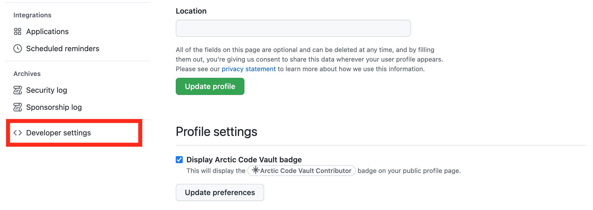
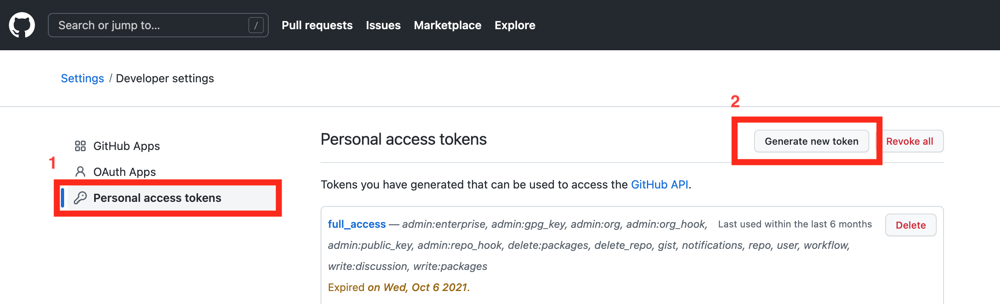
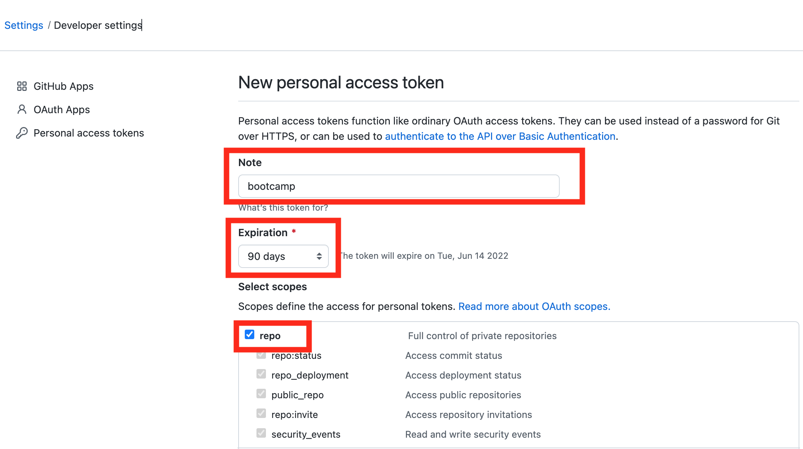
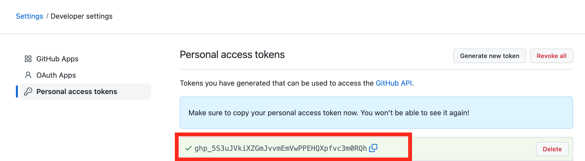
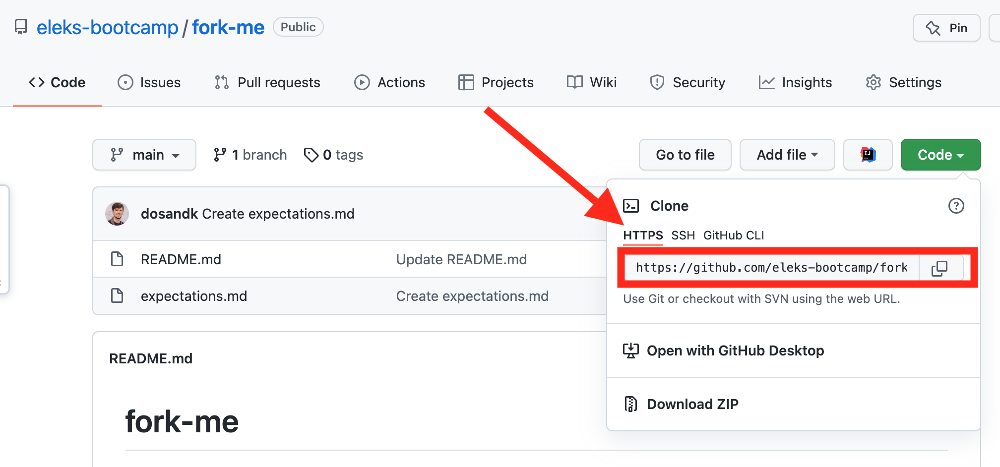

# Генерація Github токена

1. Переходимо за посиланням https://github.com
2. Клікаємо на аватарці, вибираємо "Settings"

3. На вкладці ["profile"](https://github.com/settings/profile) вибираємо "Developer settings"

4. Клікаємо на ["Personal access tokens"](https://github.com/settings/tokens)

* Натискаємо на кеопку "Generate new token"
* Заповнюємо поля:
  * Note: "bootcamp"
  * Expiration: 90
  * Вибираємо "repo" checkbox
  * Клікаємо на "Generate token"

5. Копіюємо токен та зберегаємо в надійному місці, повторно скопіювати його буде наможливо

6. Переходимо до вашого форку репозиторія

* Копіюємо посилання `https://github.com/<посилання на ваш репозиторій>.git`
* Додаємо токен до посилання `https://<ваш токен>@github.com/<посилання на ваш репозиторій>.git`
* В корні проекта виконуємо команду `git remote set-url origin <посиляння з токеном>`
